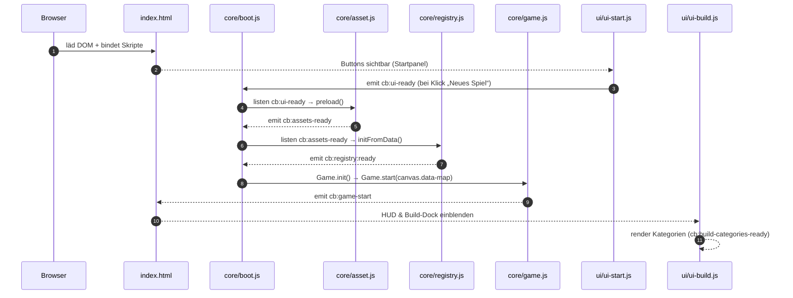

# STRUKTUR–SPICKZETTEL (Reload → Sichtbares UI & Events)

Version: v1.0 · Datum: 2025‑09‑23

Dieser Spickzettel zeigt **pro Datei**, was **beim Neuladen** der Seite sichtbar wird, was die Datei **steuert**, sowie **Events (emit/listen)**. Er entspricht deiner aktuellen Monolith-Struktur (index.html, core/*, ui/*, data/*, assets/*).

---

## 🔁 Reload → Ablauf (Kurzüberblick)

---

## 📄 index.html (Root)

**Zeigt an beim Reload:** Canvas `#game`, Startpanel, HUD-Container, Build-Dock, optional Inspector-Container. Reihenfolge der Skripte definiert, was zuerst gebunden wird.  
**Steuert:** Ein- und Ausblenden von HUD/Build-Dock, `data-map`-Attribut als Map-Quelle. Optional Inline-Wiring (Tasten/Fullscreen).  
**Events (emit):** –  
**Events (listen):** `cb:game-start` → HUD & Build-Dock sichtbar.  
**Quelle/Standard:** Startfenster zuerst, Core → UI → Tools Reihenfolge. fileciteturn15file5

---

## ⚙️ core/boot.js (Bootstrap & Lifecycle)

**Zeigt an beim Reload:** – (keine direkte UI)  
**Steuert:** Gesamtstart – hört auf `cb:ui-ready`, lädt Assets, initialisiert Registry, startet Game mit Map-URL aus `<canvas data-map="…">`.  
**Events (emit):** `cb:game-start` (nach erfolgreichem Start), `cb:boot-error` (bei Fehler).  
**Events (listen):** `cb:ui-ready`, `cb:assets-ready`, `cb:registry:ready`.  
**Nachweis/Standard:** Lebenszyklus & Eventkette dokumentiert. fileciteturn15file12

---

## 🧰 core/asset.js (Asset-Verwaltung)

**Zeigt an beim Reload:** –  
**Steuert:** Preload von Sprites/Sounds/Atlanten; stellt Loader-Hilfsfunktionen bereit.  
**Events (emit):** `cb:assets-ready` (Preload abgeschlossen).  
**Events (listen):** –  
**Nachweis/Standard:** Asset-Modul als Kernbestandteil (singular), Events `cb:*`. fileciteturn15file6

---

## 🧭 core/registry.js (Zentrale Registry)

**Zeigt an beim Reload:** –  
**Steuert:** Zusammenführen und Validieren von JSON-Daten (`data/buildings.json`, `units.json`, `balance.json`, `campaign.json`, `maps/*`, `save.json`); liefert `Registry.register/get/list`, prüft Eindeutigkeit & Icon/Sprite-Existenz.  
**Events (emit):** `cb:registry:ready` (fertig), optional `cb:registry:update`.  
**Events (listen):** `cb:assets-ready`, `cb:game-start` (für Lazy-Checks).  
**Nachweis/Standard:** Registry‑Patch (Schnittstellen/Events). fileciteturn15file14

---

## 🎮 core/game.js (Game‑Loop & World‑State)

**Zeigt an beim Reload:** – (zeichnet auf Canvas)  
**Steuert:** `Game.init()`/`Game.start(mapUrl)`, Ticker/Render, Map‑Laden und Darstellung.  
**Events (emit):** `cb:game-start` (sobald lauffähig), verschiedene `cb:res:*` optional.  
**Events (listen):** – (wird durch Boot aufgerufen)  
**Nachweis/Standard:** Game als Kernmodul mit Startkette. fileciteturn15file8

---

## 🚪 ui/ui-start.js (Startpanel)

**Zeigt an beim Reload:** Startfenster mit „Neues Spiel“ etc.  
**Steuert:** Klick auf „Neues Spiel“ → `emit('cb:ui-ready')` (oder `req:game:new`, je nach Variante). Blendet sich bei `cb:game-start` aus.  
**Events (emit):** `cb:ui-ready`, optional `req:game:new`.  
**Events (listen):** `cb:game-start` (Panel schließen).  
**Nachweis/Standard:** UI‑Start zuerst sichtbar; Events‑Verkabelung. fileciteturn15file5

---

## 📊 ui/ui-hud.js (HUD/Top‑Leiste)

**Zeigt an beim Reload:** HUD‑Container (initial verborgen).  
**Steuert:** Ressourcenanzeige, Status, ggf. FPS/Debug; wird bei `cb:game-start` sichtbar.  
**Events (emit):** z. B. `req:build:cancel` (ESC), `req:ui:fullscreen`.  
**Events (listen):** `cb:game-start`, ressourcenbezogene `cb:res:*`.  
**Nachweis/Standard:** UI‑Aufteilung/Dateiliste. fileciteturn15file15

---

## 🧱 ui/ui-build.js (Build‑Dock / Baumenü)

**Zeigt an beim Reload:** Dock‑Container (initial verborgen).  
**Steuert:** Rendert Kategorien/Items; Öffnen/Schließen; sendet Auswahl‑Events an Core.  
**Events (emit):** `req:build:select`, `cb:build:open`, `cb:build:close`.  
**Events (listen):** `cb:game-start` (Dock zeigen), `cb:build-categories-ready` (rendern), `ev:build:enabled`, `req:build:cancel`.  
**Nachweis/Standard:** Event‑Kette & Sichtbarkeitslogik. fileciteturn15file9

---

## 🗂️ ui/ui-build.categories.js (Kategorien/Items)

**Zeigt an beim Reload:** – (keine direkte UI)  
**Steuert:** Stellt CATS bereit (Epoche 1: HQ, Holzfällerhütte, Fischerhütte, Steinbruch …) – Iconpfade unter `assets/icons/build/*`.  
**Events (emit):** `cb:build-categories-ready` mit `{ categories }`.  
**Events (listen):** –  
**Nachweis/Standard:** Kategorien‑Definition & Dispatch. fileciteturn15file17

---

## 🔎 ui/ui-inspector.js (+ Bridge)

**Zeigt an beim Reload:** Inspector‑Overlay (Tabs: Logs, Tests, Ressourcen, Pfade, Editoren) – i. d. R. verborgen bis geöffnet.  
**Steuert:** Debug/QA, Editor‑Brücken, Live‑Einblicke in Registry/Assets/Events.  
**Events (emit):** z. B. `req:inspector:open`, diverse Tab‑Events.  
**Events (listen):** `cb:*` für Logs, ggf. `cb:registry:ready`.  
**Nachweis/Standard:** Inspector als Pflichtbestandteil mit definierten Tabs. fileciteturn15file14

---

## 📁 data/* (Spieldaten)

**Zeigt an beim Reload:** –  
**Steuert:** Inhalte, die Registry und Game laden (Gebäude, Einheiten, Balance, Kampagne, Karten, Saves).  
**Events (emit):** –  
**Events (listen):** –  
**Nachweis/Standard:** Datenformate & Verzeichnisaufbau. fileciteturn15file11

---

## 🖼️ assets/* (Grafiken/Icons/Sprites)

**Zeigt an beim Reload:** Start‑Hintergrund, Icons im Build‑Dock, Sprites/Atlanten.  
**Steuert:** –  
**Events (emit/listen):** –  
**Nachweis/Standard:** Asset‑Ablage & Mapping (Icons → UI, Sprites → Registry/Game). fileciteturn15file6

---

## ✅ Checkliste „Sichtbar nach Reload“

- `index.html` gebunden, **Reihenfolge**: Core → UI → Tools. fileciteturn15file5
- `ui/ui-start.js` sichtbar, Button „Neues Spiel“ feuert `cb:ui-ready`. fileciteturn15file5
- `core/boot.js` hört → Assets → Registry → Game → `cb:game-start`. fileciteturn15file12
- `ui/ui-build.categories.js` dispatcht `cb:build-categories-ready`. fileciteturn15file17
- `ui/ui-build.js` rendert Dock und öffnet es bei `cb:game-start`. fileciteturn15file9
- Canvas `<canvas id="game" data-map="…">` zeigt auf existierende Map (z. B. `data/maps/map-mini.json`). fileciteturn15file5

---

*Hinweis:* Diese Datei ist absichtlich knapp gehalten – sie dient als **Navigator**. Für tiefergehende Details siehe `docs/` (Lastenheft, Registry‑Patch, Code‑Struktur‑Vorgaben).

