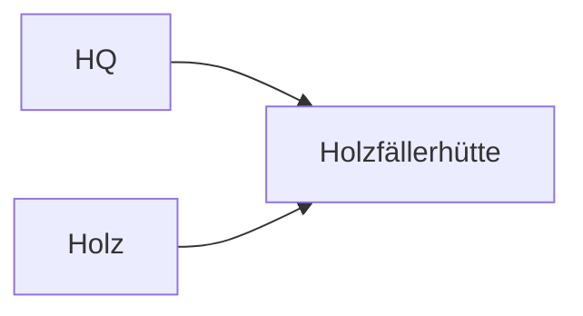

# Neue Siedler – Mermaid Diagramm-Editor (Self-Hosted)

**Version:** v1.0.0 · **Datum:** 2025-09-20

Ein schlanker, selbst-gehosteter **Mermaid-Editor/Viewer** mit Live-Vorschau, Custom-CSS (Node/Block-Farbschema),
Import/Export und Offline-Nutzung. Perfekt, um unsere Projekt-Schemata (Epoche 1) zu pflegen & zu veröffentlichen.

## 📁 Ordnerstruktur
```
siedler-mermaid-editor/
├─ tools/
│  └─ diagram-editor/
│     ├─ index.html
│     ├─ editor.css
│     ├─ editor.theme.nodeblock.css
│     └─ editor.js
├─ diagrams/
│  ├─ 01_gesamtstruktur_epoche1.mmd
│  ├─ 02_logik_events_flows.mmd
│  ├─ 03_produktionsketten_epoche1.mmd
│  └─ 04_figuren_epoche1.mmd
└─ docs/
   └─ Schemata_Epoche1.md
```

## 🚀 Einbindung ins Projekt
1. Kopiere den gesamten Ordner `siedler-mermaid-editor/` ins Repo, z. B. in `/tools/diagram-editor/` oder in die Root.
2. Öffne im Browser: `tools/diagram-editor/index.html` (Doppelklick oder per Webserver).
3. Wähle ein Mermaid-Theme (default/dark/forest/neutral). Unser Node/Block-Stil kommt aus `editor.theme.nodeblock.css`.
4. Lade `.mmd` per **Drag&Drop** oder Button „Datei öffnen…“.
5. Anpassungen im **Custom CSS** vornehmen → **Rendern** → **Export SVG/PNG** (2048 px Breite voreingestellt).
6. Autosave speichert lokal (pro Domain/Browser).

**Kiosk-Modus (Viewer only):**
- Per Button „🖥️“ oder URL: `index.html?kiosk=1`

## 🧩 Mermaid Schemata (Epoche 1)
- Rohdateien liegen in `/diagrams/`.
- Eine kombinierte Markdown-Ansicht mit eingebetteten Diagrammen: `/docs/Schemata_Epoche1.md`

## 🔗 Inspector-Verknüpfung (optional)
Im Inspector-Tab **„Editoren“** einen Link auf `tools/diagram-editor/index.html` hinterlegen.
Damit bleibt der Editor unabhängig von Spiel-Seiten und immer erreichbar.

## 🔒 Offline-Betrieb
Wenn du die CDN-Skripte offline hosten willst:
- Lade `mermaid.min.js` und optional `dompurify.min.js` in `/vendor/`.
- Ersetze die `<script src="…">`-Tags in `index.html` entsprechend.

## 🧱 Node/Block-Stil
Die Datei `editor.theme.nodeblock.css` setzt Knotenfarben, Kanten, Labels und Cluster exakt wie in unseren PNGs.
In Mermaid kannst du zusätzlich Klassen setzen:

Verfügbare Klassen:
- `:::figuren` (Gebäude/Figuren-Blöcke)
- `:::ressource` (Ressourcen-Blöcke)
- `:::ui` (UI/Inspector/Code-Blöcke)

## 📤 Export
- **SVG:** vektorisiert (ideal für Doku)
- **PNG:** Bitmap mit einstellbarer Breite (Standard 2048 px)

## ✔️ Kompatibilität
- Getestet in aktuellen Chromium/Firefox/Safari.
- Keine Build-Tools erforderlich.

Viel Spaß beim Dokumentieren! ✨
