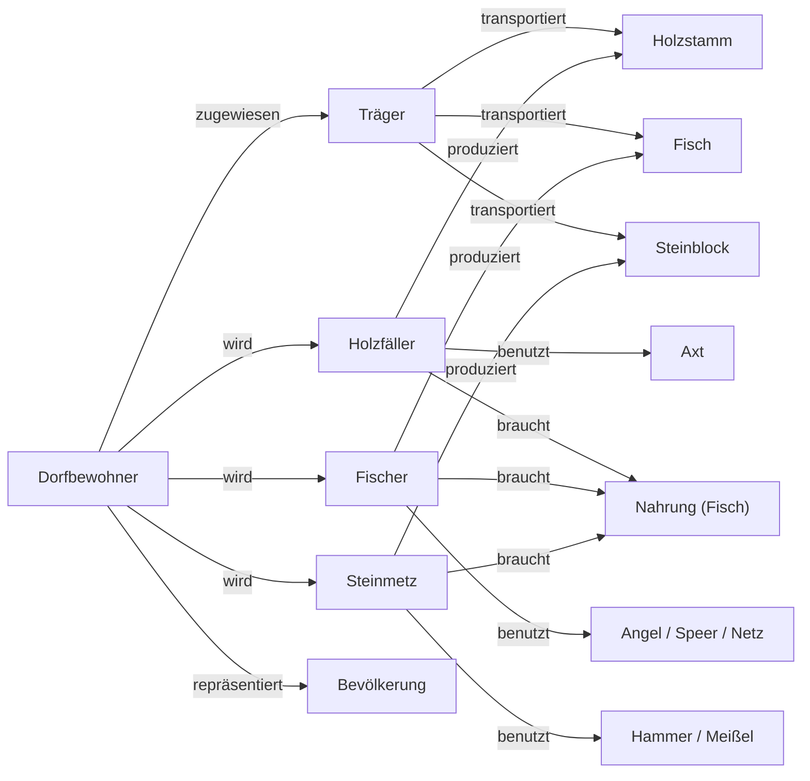

# Neue Siedler – Epoche 1 · Schemata (Mermaid)

Dieses Dokument bündelt alle aktuellen Diagramme (Stand 2025-09-20).
Die Diagramme sind direkt in **Mermaid** eingebettet und können im Repo mit deinem Viewer angezeigt werden.

**Hinweis:** Der Editor liegt unter `tools/diagram-editor/` und kann lokale `.mmd` laden oder dieses Dokument kopieren.

---

## 04_figuren_epoche1

